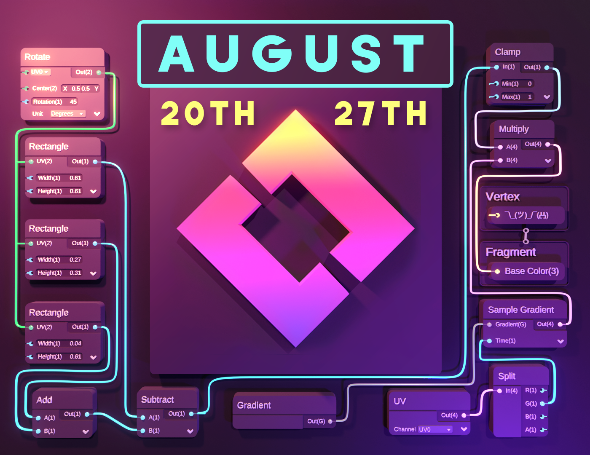
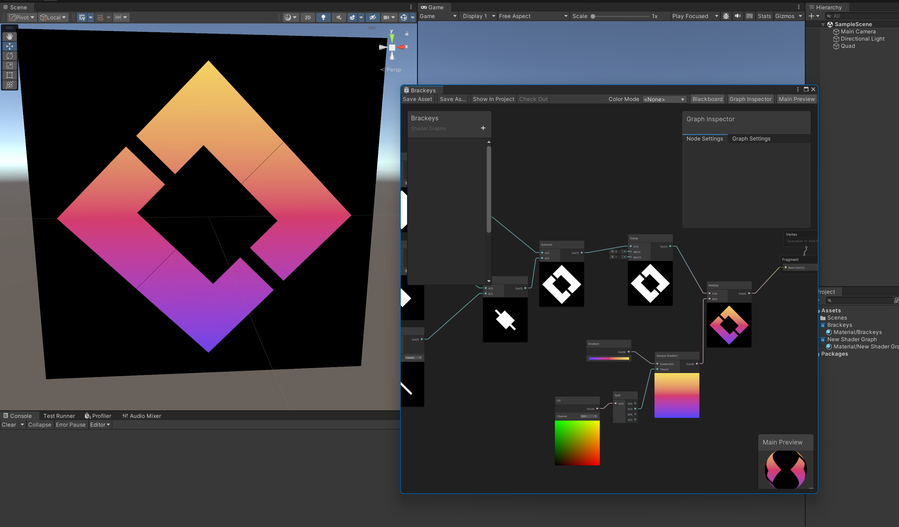

# Brackeys Game Jam 2023.2 Shader

The art by Kocy for the Brackeys Game Jam 2023.2 poster contains settings that can be used to create a shader in Unity's Shader Graph.

The final result is the Brackeys Logo seen below.

This repository contains the Unity project with that shader graph. Nothing more, nothing less.